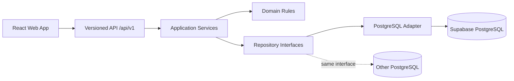

# FULL WEB APP PRD — QC Raw Material Native Web
## Supabase/PostgreSQL + React/Vite/TanStack + API Mid-Layer

**Status:** DRAFT FOR ARCHITECTURE REVIEW — Source of Truth calon pengganti Google Apps Script/Google Sheets  
**Tanggal:** 19 Agustus 2026  
**Owner bisnis:** QC / Raw Material — PT Semen Tonasa  
**Baseline bisnis:** QC Raw Material V2.8 + V3.0/V3.0.1 Vendor Fleet & Crusher Retase  
**Target platform:** Full native web application  
**Frontend:** React + Vite + TanStack ecosystem  
**Backend:** TypeScript API service + Fastify  
**Database awal:** Supabase managed PostgreSQL  
**Database portability target:** PostgreSQL standar, tanpa ketergantungan wajib pada Supabase Data API  
**Deployment target:** GitHub → Vercel dan/atau personal VPS  
**Timezone operasi:** `Asia/Makassar`  
**API style:** Versioned REST JSON + OpenAPI 3.x  
**Dokumen ini:** `full_web_app_PRD.md`

---

# 1. Tujuan Dokumen

Dokumen ini adalah **source of truth** untuk pembangunan ulang QC Raw Material menjadi aplikasi web native yang tidak lagi menjadikan Google Sheets/Apps Script sebagai runtime utama.

Dokumen mengikat:

1. domain bisnis;
2. scope produk;
3. terminologi;
4. arsitektur frontend;
5. arsitektur backend/API;
6. data model PostgreSQL;
7. business rules;
8. security model;
9. migration strategy;
10. deployment model;
11. acceptance criteria;
12. rencana implementasi frontend dan backend;
13. aturan perubahan aplikasi setelah production.

Jika implementasi menyimpang dari dokumen ini, PRD harus diperbarui melalui ADR/decision log terlebih dahulu.

---

# 2. Sumber Referensi / Baseline

PRD ini diturunkan dari proses dan artefak existing berikut:

- `PRD_QC_RawMaterial_V3_Vendor_Retase.md`
- `README_V2_8.md`
- `Code(2).gs`
- `QC_Workbench(3).html`
- `QC_WebApp(2).html`
- `QC_WebApp_CSS(2).html`
- `QC_WebApp_JS(2).html`
- `QC_RawMaterial_V2_8_Audit_UX.zip`
- `QC_RawMaterial_V2_5_GoogleSheets_Ready(1).xlsx`
- `kalkulator_vendor.xlsx`
- foto tally `Counter Ret Limestone`
- foto tally `Counter Ret Clay`
- package V3.0 implementation + V3.0.1 hotfix Shift Report/Counter
- contoh laporan WhatsApp vendor AM/AA.

### Baseline yang wajib dipertahankan

Native web **bukan rewrite bebas**. Fungsi bisnis yang sudah valid pada V2.8/V3 harus tetap tersedia, termasuk:

- raw sample Limestone dan Clay;
- Workbench Load Samples;
- New Mix;
- Recall/Edit Mix;
- Save/Replace Mix;
- Retase dan Ton/Retase;
- chemistry snapshot;
- edit oxide dengan alasan wajib;
- audit/changelog;
- Mix Summary;
- Pile Cumulative;
- QAF;
- Reporting;
- Vendor Shift Report;
- loading assignment AM ↔ AA;
- Digital Crusher Counter;
- event idempotency;
- append-only reversal;
- QC Retase Reconciliation;
- Sample_ID mapping;
- Workbench mapped-retase suggestion;
- double-consumption protection;
- RBAC.

---

# 3. Latar Belakang dan Problem Statement

Sistem saat ini berevolusi dari spreadsheet → Google Sheets → Apps Script Web App. Hal tersebut berhasil mendigitalisasi proses, tetapi memiliki batas arsitektural:

1. schema database direpresentasikan sebagai sheet/header;
2. backend logic besar berada di Apps Script;
3. query relasional, concurrency, transaction, indexing, dan testability terbatas;
4. frontend dan backend memiliki coupling tinggi;
5. schema drift mudah terjadi;
6. deployment/versioning tidak senyaman software repository biasa;
7. event retase akan menghasilkan volume data yang terus meningkat;
8. fitur baru berisiko membuat satu Web App semakin monolitik;
9. pergantian backend database sulit jika browser langsung bergantung pada provider tertentu;
10. bug tipe data seperti `operation_date` string vs Date object harus dieliminasi pada model native.

Target baru adalah membangun **modular monolith** yang dapat berkembang menjadi service terpisah hanya jika memang diperlukan.

---

# 4. Product Vision

Membangun satu platform QC Raw Material yang menjadi rantai data digital dari:

```text
Raw Sample / Laboratory
        ↓
Vendor Fleet & Loading Assignment
        ↓
Crusher Dump / Retase Event
        ↓
QC Reconciliation & Sample Mapping
        ↓
QC Mixing Workbench
        ↓
Mix Detail / Chemistry Snapshot
        ↓
Summary / Pile Cumulative / QAF
        ↓
Operational & Management Reporting
```

Prinsip produk:

- **single source of truth** di PostgreSQL;
- **API-first**;
- **frontend tidak mengakses tabel bisnis langsung**;
- **PostgreSQL portable**;
- **domain modules terpisah**;
- **auditability by design**;
- **append-only untuk event operasional kritis**;
- **server/database time authoritative**;
- **QC tetap final control point untuk retase yang masuk mix**;
- **ambiguity tidak boleh diselesaikan dengan tebakan otomatis**.

---

# 5. Product Goals

## G-01 — Native Web Platform

Menghapus ketergantungan runtime utama pada Google Sheets/Apps Script tanpa kehilangan fungsi existing.

## G-02 — Database Integrity

Memindahkan data ke PostgreSQL dengan PK/FK, constraint, transaction, index, dan migration yang eksplisit.

## G-03 — API Boundary

Seluruh business operation dilakukan melalui API sehingga database provider dapat diganti tanpa rewrite frontend.

## G-04 — Modular Growth

Penambahan fitur/halaman baru tidak memerlukan perubahan besar pada module existing.

## G-05 — Operational Traceability

Dari `Mix_ID` dapat ditelusuri kembali ke Sample_ID, vendor, AM, AA, crusher, retase event, source/block, user pencatat, dan audit perubahan.

## G-06 — Reliable Counter

Satu dump aktual menghasilkan satu event retase dan duplicate retry tidak menghasilkan retase kedua.

## G-07 — QC Governance

Observed retase tidak langsung menjadi final mix tanpa mapping/approval logic QC.

## G-08 — Deployment Portability

Aplikasi dapat dijalankan pada:

- Vercel;
- Vercel frontend + VPS API;
- full VPS/container;
- PostgreSQL Supabase;
- PostgreSQL managed lain;
- PostgreSQL self-hosted.

---

# 6. Non-Goals MVP Native Web

Tidak termasuk MVP awal:

- GPS live fleet tracking;
- IoT/CAN bus integration;
- ANPR/camera identification;
- OCR tally sebagai source utama;
- AI auto-dispatch;
- fleet maintenance CMMS lengkap;
- fuel management;
- vendor billing/payment;
- WhatsApp parser sebagai authoritative input;
- microservices decomposition;
- Kubernetes;
- event streaming platform seperti Kafka.

Semua dapat ditambahkan melalui extension point setelah core stabil.

---

# 7. Keputusan Bisnis Existing yang Tetap Berlaku

## 7.1 Role

Role final MVP:

- `VENDOR`
- `CRUSHER_OPERATOR`
- `QC_ANALYST`
- `SUPERVISOR_ADMIN`

Supervisor dan Admin tetap digabung satu role.

## 7.2 Crusher Master

### Limestone

- `CR LS 23`
- `CR LS 4`
- `CR LS 5`

### Clay

- `CR CY 4`
- `CR CY 5`

Backend menggunakan immutable canonical ID, contoh:

- `CR_LS_23`
- `CR_LS_4`
- `CR_LS_5`
- `CR_CY_4`
- `CR_CY_5`

Display name dapat berubah tanpa mengubah ID.

## 7.3 Shift

- Shift 1 = `07:30–15:30`
- Shift 2 = `15:30–22:30`
- Shift 3 = `22:30–07:30`

Shift 3 melewati tengah malam.

`operation_date` adalah tanggal saat Shift 3 **dimulai**.

Contoh:

```text
event_ts       = 2026-08-19 02:15 +08
shift           = 3
operation_date  = 2026-08-18
```

## 7.4 Material canonical awal

MVP mempertahankan canonical material awal:

- `PILE`
- `FILLER`

Master dapat diperluas tanpa migration kode.

## 7.5 Sample Mapping

MVP mempertahankan rule bisnis saat ini:

```text
operation_date + material_kind + Vendor
```

Field `Vendor` adalah field authoritative untuk candidate matching awal.

Jika candidate > 1 → `AMBIGUOUS` dan QC harus memilih manual.

Source/block **tidak boleh diam-diam dijadikan filter mandatory** tanpa keputusan bisnis baru.

## 7.6 Ton/Retase

Perilaku existing dipertahankan:

- Limestone default awal = 25 ton/retase;
- Clay dapat memakai rule Vendor/Source;
- fallback Clay = 25;
- QC dapat mengubah sesuai rule yang diizinkan;
- rule dipindahkan ke master table, bukan hardcoded.

## 7.7 Undo Counter

Crusher Operator dapat reversal event miliknya maksimum **10 menit** setelah event dengan reason wajib.

`SUPERVISOR_ADMIN` dapat correction di luar window sesuai audit rule.

## 7.8 Parallel Run Tolerance

Tolerance pilot existing:

```text
MAX(1 retase, 0.5% × digital observed retase)
```

Software duplicate, wrong vendor mapping, wrong Sample_ID, double consumption, dan silent event deletion tetap dianggap kegagalan walaupun total masih di dalam tolerance.

---

# 8. Target Technology Stack

Versi minor/patch **tidak dikunci di PRD**. Implementasi harus menggunakan stable release pada saat bootstrap project, lalu dikunci melalui `pnpm-lock.yaml`.

## 8.1 Frontend

- React 19.x
- TypeScript strict mode
- Vite 8.x
- TanStack Router — file-based routing
- TanStack Query — server-state/cache/mutation
- TanStack Table — data grid/table state
- TanStack Form — form state dan validation integration
- TanStack Virtual — hanya untuk daftar/event besar
- Tailwind CSS
- shadcn/ui atau komponen internal berbasis Radix primitives
- Lucide icons

### Prinsip

TanStack digunakan sebagai **headless application infrastructure**, bukan sebagai visual design system.

## 8.2 Backend

- Node.js LTS/current production line
- TypeScript strict mode
- Fastify
- JSON Schema/OpenAPI route contract
- Drizzle ORM + Drizzle migrations
- `postgres.js` atau driver PostgreSQL yang didukung Drizzle
- Argon2id password hashing
- structured logger

## 8.3 Database

Initial:

- Supabase PostgreSQL

Portability requirement:

- SQL schema harus valid PostgreSQL;
- tidak boleh ada ketergantungan business-critical pada Supabase-only API;
- Supabase-specific integration diletakkan pada adapter/infrastructure module;
- migration dijalankan dari repository, bukan hanya Supabase Dashboard.

## 8.4 Testing

- Vitest — unit/component/service tests
- React Testing Library — component behavior
- Playwright — E2E/browser
- PostgreSQL test database/container untuk repository integration test

## 8.5 Repository/CI

- GitHub
- pnpm workspace monorepo
- GitHub Actions
- Conventional Commits direkomendasikan
- branch protection untuk `main`

---

# 9. Architecture Decision — API Mid-Layer Mandatory

Frontend **dilarang** melakukan CRUD business tables langsung dengan `supabase-js`.

Target:



Manfaat:

1. database dapat diganti;
2. frontend tidak mengetahui schema database;
3. authorization tetap server-side;
4. business transaction memiliki satu boundary;
5. API contract dapat dipakai aplikasi mobile/integrasi lain;
6. query database dapat dioptimasi tanpa mengubah frontend.

---

# 10. Architectural Style

Gunakan **modular monolith**.

Jangan membuat microservice per module pada fase awal.

Module utama:

```text
iam
master-data
raw-sample
mixing
vendor-operation
retase
reconciliation
reporting
audit
system
```

Setiap module memiliki:

```text
route/controller
application/service
domain/rules
repository interface
postgres repository implementation
schema/contract
test
```

Module tidak membaca table module lain secara acak. Cross-module flow dilakukan melalui application service/repository contract yang jelas.

---

# 11. Monorepo Structure

```text
qc-raw-material/
├─ apps/
│  ├─ web/                      # React + Vite
│  └─ api/                      # Fastify API
│
├─ packages/
│  ├─ contracts/                # API DTO, shared enums, generated types
│  ├─ domain/                   # pure domain calculations/rules
│  ├─ db/                       # Drizzle schema + migrations
│  ├─ ui/                       # shared design-system components
│  ├─ config/                   # eslint/tsconfig/env contracts
│  └─ test-utils/
│
├─ infra/
│  ├─ docker/
│  ├─ vercel/
│  ├─ nginx-or-caddy/
│  └─ scripts/
│
├─ docs/
│  ├─ full_web_app_PRD.md
│  ├─ ADR/
│  ├─ API/
│  └─ migration/
│
├─ .github/workflows/
├─ pnpm-workspace.yaml
├─ package.json
└─ pnpm-lock.yaml
```

### Boundary rule

`apps/web` tidak boleh import `packages/db`.

Frontend hanya boleh menggunakan:

- `packages/contracts`;
- `packages/domain` untuk pure presentation-safe calculations jika diperlukan;
- `packages/ui`.

---

# 12. API Contract Strategy

API prefix:

```text
/api/v1
```

Semua route memiliki:

- request schema;
- response schema;
- authorization rule;
- normalized error;
- OpenAPI documentation;
- integration test.

### Versioning

Breaking change API membutuhkan `/api/v2` atau controlled deprecation.

UI dan API boleh dideploy independen selama contract compatibility dijaga.

### Standard response list

```json
{
  "data": [],
  "meta": {
    "page": 1,
    "pageSize": 50,
    "total": 120
  }
}
```

### Standard error

```json
{
  "error": {
    "code": "AMBIGUOUS_SAMPLE",
    "message": "Lebih dari satu Sample_ID memenuhi rule mapping.",
    "requestId": "...",
    "details": {}
  }
}
```

Minimum error code:

- `AUTH_REQUIRED`
- `AUTH_EXPIRED`
- `INVALID_CREDENTIALS`
- `ACCOUNT_DISABLED`
- `FORBIDDEN`
- `VALIDATION_ERROR`
- `CONFLICT`
- `DUPLICATE_REQUEST`
- `ASSIGNMENT_NOT_FOUND`
- `AMBIGUOUS_ASSIGNMENT`
- `SAMPLE_NOT_FOUND`
- `AMBIGUOUS_SAMPLE`
- `RETASE_ALREADY_CONSUMED`
- `REVISION_REVIEW_REQUIRED`
- `NOT_FOUND`
- `RATE_LIMITED`
- `INTERNAL_ERROR`

---

# 13. Authentication & Session Architecture

## 13.1 Login Requirement

Tetap mendukung:

- username;
- password;
- status ACTIVE/DEACTIVATED;
- last login;
- failed login protection;
- role;
- vendor scope;
- crusher scope.

## 13.2 Password Storage

Password tidak pernah disimpan plaintext.

Native app menggunakan:

- Argon2id;
- per-password salt;
- parameter hashing terkonfigurasi dan versioned;
- rehash on login jika parameter lama sudah obsolete.

## 13.3 Session

Gunakan opaque session token.

Browser menyimpan session pada cookie:

- `HttpOnly`;
- `Secure` pada production;
- `SameSite=Lax` atau lebih ketat sesuai deployment;
- expiry configurable;
- session dapat direvoke.

Database menyimpan **hash token**, bukan raw token.

## 13.4 Authorization

Authorization selalu server-side.

Browser role hanya digunakan untuk navigation rendering.

## 13.5 Role Scope

### VENDOR

- hanya vendor sendiri;
- shift report/history sendiri.

### CRUSHER_OPERATOR

- hanya crusher dalam scope user;
- assignment yang relevan dengan crusher/shift.

### QC_ANALYST

- sample;
- Workbench;
- reconciliation;
- reporting QC.

### SUPERVISOR_ADMIN

- seluruh operational view;
- master data;
- user management;
- audit;
- controlled override.

---

# 14. Database Security Strategy

Karena frontend hanya mengakses API:

1. business tables diletakkan pada schema PostgreSQL non-public, mis. `app`;
2. frontend tidak menerima database credential;
3. Supabase anon/service client tidak digunakan untuk CRUD core dari browser;
4. API memakai dedicated DB role dengan least privilege;
5. DB grants menjadi lapisan keamanan tambahan;
6. jika sebagian table nanti diekspos via Supabase Data API, RLS wajib diaktifkan untuk table tersebut;
7. RLS bukan pengganti authorization API.

Keputusan ini mempertahankan portability ke PostgreSQL selain Supabase.

---

# 15. Core Data Type Rules

## 15.1 Date

`operation_date` disimpan sebagai PostgreSQL `date`.

API selalu mengirim ISO:

```text
YYYY-MM-DD
```

Tidak boleh menyimpan business date sebagai locale-formatted string.

## 15.2 Timestamp

Audit/event timestamps memakai `timestamptz`.

Authoritative time = database/server.

Frontend hanya melakukan display menggunakan `Asia/Makassar`.

## 15.3 Time

Shift boundary/assignment local times memakai `time` + `operation_date` semantics yang eksplisit.

Overnight range wajib memiliki helper domain yang sama di semua module.

---

# 16. Proposed PostgreSQL Schema

Nama final column dapat disempurnakan saat migration design, tetapi semantics tidak boleh berubah tanpa ADR.

## 16.1 IAM

### `app.users`

- `id uuid PK`
- `username citext UNIQUE NOT NULL`
- `display_name text NOT NULL`
- `password_hash text NOT NULL`
- `role user_role NOT NULL`
- `vendor_id uuid NULL FK`
- `status user_status NOT NULL`
- `last_login_at timestamptz NULL`
- `failed_login_count integer NOT NULL DEFAULT 0`
- `locked_until timestamptz NULL`
- `created_at timestamptz`
- `created_by uuid NULL`
- `updated_at timestamptz`
- `updated_by uuid NULL`

### `app.user_crusher_scopes`

- `user_id uuid FK`
- `crusher_id uuid FK`
- PK `(user_id, crusher_id)`

Tidak menggunakan CSV `crusher_scope` pada database baru.

### `app.sessions`

- `id uuid PK`
- `user_id uuid FK`
- `token_hash text UNIQUE`
- `created_at timestamptz`
- `expires_at timestamptz`
- `revoked_at timestamptz NULL`
- `last_seen_at timestamptz`
- `ip_hash text NULL`
- `user_agent text NULL`

---

# 17. Master Data Schema

## `app.vendors`

- id
- code
- name
- active
- contact info optional
- created/updated audit fields

## `app.vendor_aliases`

- vendor_id
- alias
- normalized_alias

Digunakan untuk migration dan data-cleaning, bukan untuk mengganti canonical vendor.

## `app.equipment`

- id
- vendor_id
- type = `AM` / `AA`
- unit_no
- brand
- model
- active
- metadata jsonb optional

Unique:

```text
vendor_id + type + unit_no
```

## `app.crushers`

- id
- code
- name
- material_kind = LS/CL
- plant_id
- active

## `app.sources`

- id
- code
- name
- block
- material_category
- material_kind
- active

## `app.plants`

- id
- code
- name
- active

## `app.piles`

- id
- plant_id
- material_kind
- name
- class_name
- active

## `app.shifts`

- code = 1/2/3
- name
- start_time
- end_time
- crosses_midnight boolean
- active

## `app.ton_per_retase_rules`

Priority-capable rule:

- id
- material_kind
- vendor_id nullable
- source_id nullable
- equipment_id nullable
- ton_per_retase numeric
- priority integer
- valid_from date nullable
- valid_to date nullable
- active

## `app.quality_targets`

Configurable target:

- target_key
- material_kind
- plant_id nullable
- class_group nullable
- min_value nullable
- max_value nullable
- effective_from
- effective_to nullable

---

# 18. Raw Sample / Laboratory Schema

Alih-alih dua physical table terpisah, native app menggunakan satu table dengan `material_kind`.

## `app.raw_samples`

- `id uuid PK`
- `sample_id text UNIQUE NOT NULL`
- `material_kind enum LS/CL`
- `sample_no integer/text`
- `operation_date date`
- `shift_text/source_shift nullable`
- `grade_type text nullable`
- `vendor_id uuid nullable`
- `vendor_snapshot text nullable`
- `source_id uuid nullable`
- `source_location_snapshot text nullable`
- `loader_unit_no text nullable`
- `block text nullable`
- `direction text nullable`
- `sio2 numeric`
- `al2o3 numeric`
- `fe2o3 numeric`
- `cao numeric`
- `mgo numeric`
- `k2o numeric`
- `na2o numeric`
- `so3 numeric`
- `h2o numeric`
- `note text`
- `created_at`
- `updated_at`

Derived quality tidak wajib disimpan sebagai authoritative column.

Gunakan generated calculation/domain query untuk:

```text
LSF = 100*CaO/(2.8*SiO2 + 1.18*Al2O3 + 0.65*Fe2O3)
SM  = SiO2/(Al2O3 + Fe2O3)
AM  = Al2O3/Fe2O3
NaEq = Na2O + 0.658*K2O
R2O3 = SiO2 + Al2O3 + Fe2O3
```

Jika disimpan untuk performance, nilainya harus generated/derived dan tidak dapat diedit independen.

---

# 19. Vendor Shift Report Schema

## `app.vendor_shift_reports`

- id
- report_group_id
- vendor_id
- operation_date
- shift_code
- version
- status = DRAFT/SUBMITTED/SUPERSEDED
- AM summary fields
- AA summary fields
- note
- revision_reason nullable
- submitted_at
- submitted_by
- created_at/by
- updated_at/by

Unique:

```text
vendor_id + operation_date + shift_code + version
```

Satu report group memiliki banyak version.

## Load semantics penting

Frontend harus dapat selalu mendapatkan **latest report state** untuk `vendor + operation_date + shift`.

API tidak boleh bergantung pada implicit Date-object conversion seperti Apps Script.

Endpoint current report wajib deterministic.

---

# 20. Loading Assignment Schema

## `app.loading_assignments`

- id
- shift_report_id
- vendor_id
- am_equipment_id
- source_id nullable
- block_snapshot
- material_category
- material_kind
- crusher_id
- valid_from local time nullable
- valid_to local time nullable
- status ACTIVE/CLOSED/CANCELLED
- note
- created_at/by
- updated_at/by

## `app.loading_assignment_aas`

- assignment_id
- aa_equipment_id
- valid_from nullable
- valid_to nullable
- status
- note

Constraint/application rule:

AA yang sama tidak boleh memiliki assignment overlap pada operation date + shift yang sama.

---

# 21. Retase Event Ledger

## `app.retase_events`

Append-only.

- `id uuid PK`
- `request_id uuid UNIQUE NOT NULL`
- `operation_date date NOT NULL`
- `event_ts timestamptz NOT NULL DEFAULT now()`
- `shift_code`
- `crusher_id`
- `vendor_id nullable`
- `assignment_id nullable`
- `am_equipment_id nullable`
- `aa_equipment_id nullable`
- `aa_unit_snapshot text`
- `source_id nullable`
- `material_category nullable`
- `delta smallint CHECK(delta IN (-1,1))`
- `event_type DUMP/REVERSAL/MANUAL_CORRECTION`
- `resolution_status MATCHED/UNASSIGNED/AMBIGUOUS`
- `reverses_event_id uuid nullable`
- `reason text nullable`
- `created_by uuid`
- `client_event_ts timestamptz nullable`
- `client_device_id text nullable`

### Constraints

- `request_id` unique;
- normal DUMP = `delta +1`;
- reversal = `delta -1`;
- reversal harus menunjuk original event;
- satu original event tidak boleh direversal dua kali tanpa controlled supervisor correction;
- event tidak boleh dihapus melalui application API.

### Partition readiness

Schema harus siap dipartisi berdasarkan `operation_date` jika volume meningkat, tetapi partitioning tidak wajib pada MVP.

---

# 22. QC Retase Mapping / Allocation

## `app.qc_retase_allocations`

- id
- operation_date
- shift_code
- crusher_id
- vendor_id
- assignment_id
- sample_id FK
- status UNMAPPED/SUGGESTED/AMBIGUOUS/CONFIRMED/CONSUMED/REVIEW_REQUIRED
- observed_retase
- approved_retase
- override_reason nullable
- confirmed_by/at
- consumed_mix_id nullable
- consumed_at nullable
- created_at
- updated_at

Satu assignment boleh dialokasikan ke lebih dari satu Sample_ID.

### No double use

Total approved retase yang consumed tidak boleh melebihi retase valid assignment setelah reversal.

Check dilakukan dalam database transaction ketika Save Mix.

---

# 23. Mixing Schema

## `app.mixes`

- id uuid
- mix_id text UNIQUE
- material_kind
- operation_date
- pile_id
- plant_id
- class_name snapshot
- shift_code/text snapshot
- `batch_no integer nullable` untuk LS
- `tiang_ke text nullable` untuk CL
- pile_cycle integer
- status ACTIVE/REPLACED/VOID
- replaced_mix_id nullable
- notes
- created_by/at
- updated_by/at

### Validation

- LS membutuhkan `batch_no`;
- CL membutuhkan `tiang_ke`;
- `tiang_ke` dapat berupa range teks seperti `1-4` / `5-6`;
- mix replacement dilakukan controlled, bukan destructive overwrite tanpa history.

## `app.mix_items`

- id
- mix_id FK
- raw_sample_id FK
- retase
- ton_per_retase
- tonnage
- note
- chemistry snapshot columns:
  - sio2
  - al2o3
  - fe2o3
  - cao
  - mgo
  - k2o
  - na2o
  - so3
  - h2o
- created_at

`tonnage = retase × ton_per_retase`.

Chemistry snapshot adalah nilai pada saat mix disimpan, sehingga perubahan raw sample kemudian tidak mengubah historical mix.

---

# 24. Oxide Edit / Audit Model

Existing V2.8 memiliki edit oxide snapshot + Note wajib + Changelog.

Native model dinormalisasi.

## `app.mix_item_chemistry_revisions`

- id
- mix_item_id
- revision_no
- before_values jsonb
- after_values jsonb
- change_note NOT NULL
- changed_by
- changed_at

Aturan:

- raw sample tidak berubah;
- hanya snapshot mix item yang direvisi;
- derived LSF/SM/AM/NaEq dihitung ulang;
- no silent update;
- history dapat dilihat dari UI.

---

# 25. Derived Mix Summary

Tidak membuat editable summary table.

Canonical source:

```text
mixes + mix_items
```

## Weighted chemistry

Untuk oxide `X`:

```text
Mix_X = Σ(tonnage × X) / Σ tonnage
```

Derived:

```text
LSF, SM, AM, NaEq, R2O3
```

dihitung dari weighted oxide hasil mix.

Expose melalui database view/API query:

```text
app.v_mix_summary
```

Materialized view hanya ditambahkan jika profiling membuktikan diperlukan.

---

# 26. Pile Cumulative

Existing logic:

```text
Σ batch weighted per Plant + Pile + Pile_Cycle sampai cutoff date
```

Native implementation menggunakan view/query service.

Authoritative data tetap `mixes + mix_items`.

Endpoint menerima:

- material;
- plant;
- pile;
- class;
- cutoff date;
- pile cycle.

---

# 27. QAF Rules

## Limestone

Setiap tanggal mempunyai 3 group tampilan tetap:

1. Barat / Utara
2. Timur / Selatan
3. Filler

Jika tidak ada data, row tetap ditampilkan sebagai `NO DATA`.

## Clay

Setiap tanggal mempunyai 2 group tetap:

1. Utara
2. Selatan

Jika tidak ada data, row tetap `NO DATA`.

### Existing target baseline

Initial configurable targets dari master existing:

- `LS_R2O3`: max 3
- `LS_LSF_PILE`: 1100–5000
- `LS_LSF_FILLER`: 2000–5000
- `CL_SM`: 2.30–2.80
- `CL_AM`: 1.40–2.00

Nilai target dipindahkan ke DB master dan dapat diberi effective date.

---

# 28. Generic Audit

## `app.audit_logs`

- id
- occurred_at
- actor_user_id
- actor_role
- action
- entity_type
- entity_id
- before_json nullable
- after_json nullable
- reason nullable
- request_id
- ip metadata optional

Audit wajib untuk:

- login/security event summary;
- user activate/deactivate;
- role/scope change;
- master changes;
- shift report save/submit/revision;
- assignment change;
- retase reversal/correction;
- QC sample mapping;
- retase override;
- mix save/replace;
- chemistry revision;
- configuration change.

Retase event sendiri tetap menjadi operational ledger dan tidak perlu diduplikasi penuh ke audit log.

---

# 29. Future Outbox Extension

Siapkan optional:

```text
app.outbox_events
```

untuk future notification/integration:

- WhatsApp notification;
- email;
- webhook;
- ERP integration;
- analytics pipeline.

MVP tidak membutuhkan message broker.

---

# 30. Key Indexes

Minimum:

```text
raw_samples(operation_date, material_kind, vendor_id)
raw_samples(sample_id unique)
vendor_shift_reports(vendor_id, operation_date, shift_code, version desc)
loading_assignments(shift_report_id, crusher_id)
loading_assignment_aas(aa_equipment_id, assignment_id)
retase_events(operation_date, shift_code, crusher_id)
retase_events(assignment_id, event_ts)
retase_events(request_id unique)
qc_retase_allocations(operation_date, status)
qc_retase_allocations(sample_id, status)
mixes(mix_id unique)
mixes(operation_date, material_kind, plant_id, pile_id)
mix_items(mix_id)
mix_items(raw_sample_id)
audit_logs(entity_type, entity_id, occurred_at desc)
```

Index final harus berdasarkan `EXPLAIN ANALYZE`, bukan ditambahkan tanpa profiling.

---

# 31. Transaction Boundaries

Database transaction wajib untuk operasi yang dapat menghasilkan inconsistency.

## Save Mix

Satu transaction:

1. validate current retase allocation;
2. verify not consumed by other mix;
3. create/replace mix;
4. insert mix items;
5. create chemistry audit if applicable;
6. mark allocation `CONSUMED`;
7. write audit;
8. commit.

Jika salah satu gagal → rollback seluruh transaction.

## Retase reversal

Satu transaction:

1. lock/read original event;
2. validate reversal eligibility;
3. ensure no duplicate reversal;
4. insert `-1` event;
5. mark related allocation review jika dibutuhkan;
6. audit;
7. commit.

---

# 32. Functional Module — Raw Sample

## FR-RS-01

QC dapat membuat/mengimport raw sample Limestone/Clay.

## FR-RS-02

Fields existing dipertahankan:

- Sample_ID
- No_Sampel
- Tanggal
- Jam/Shift
- Grade/Type
- Vendor
- Source/Lokasi
- No_Alat_Muat
- Blok
- Arah
- oxide chemistry
- Keterangan.

## FR-RS-03

Sample_ID unique.

## FR-RS-04

Derived quality dihitung konsisten dari satu shared domain function.

## FR-RS-05

Raw chemistry edit memiliki audit tersendiri jika fitur edit diaktifkan di masa depan.

---

# 33. Functional Module — QC Mixing Workbench

Page:

```text
/app/qc/workbench
```

## Header

- Material LS/CL
- Operation Date
- Pile
- Plant
- Class
- Shift
- Batch_No untuk LS / Tiang_ke untuk CL
- Pile Cycle
- Default Ton/Retase
- Mix_ID Preview
- Mode NEW/EDIT

## Grid

- Sample ID
- No Sample
- Type/Grade
- Vendor
- Source
- quality values
- Mapped Retase
- Retase Input
- Ton/Retase
- Tonase
- Note
- Audit indicator
- Actions View/Edit Oxide

## Actions

- Load Samples
- New Mix
- Recall Mix
- Apply mapped retase per sample
- Apply All valid mapped retase
- Save Mix
- Replace Mix

## Validation

- header complete;
- minimum one Retase > 0;
- oxide override requires Note;
- retase override vs mapping requires Note;
- consumed mapping conflict blocks Save;
- no silent mix overwrite.

---

# 34. Functional Module — Vendor Shift Report

Page:

```text
/app/vendor/shift-reports
```

## Header

- operation date
- shift
- vendor from session
- version
- status
- prepared by

## Fleet Summary

AM:

- total
- operating
- standby
- breakdown
- repair
- other

AA:

- total
- operating
- standby
- breakdown
- repair
- other

Validation:

```text
Total = Operating + Standby + Breakdown + Repair + Other
```

## Assignment

Repeated card:

- AM
- block/source
- material
- crusher destination
- start/end time optional
- AA searchable multi-select
- note

## Lifecycle

```text
DRAFT → SUBMITTED → SUPERSEDED by next revision
```

### Critical load behavior

On date/shift change and page reload, frontend must call deterministic current-report endpoint.

A successfully saved draft **harus dapat dimuat kembali**, diedit, dan kemudian submitted.

---

# 35. Functional Module — Digital Retase Counter

Page:

```text
/app/counter
```

## Context

- operation date
- shift
- crusher

Counter hanya memuat assignment dari effective `SUBMITTED` report.

## UI

```text
Vendor BATARA
  AM 05 — B9 Tengah — PILE
    [AA 02 | 4]
    [AA 10 | 3]
    [AA 12 | 7]
```

## Interaction

1 tap AA → satu `DUMP +1` event.

### Idempotency

Client membuat UUID `request_id` sebelum request.

Retry request ID yang sama harus mengembalikan hasil event existing, bukan insert kedua.

## Pending status

UI membedakan:

- pending/local;
- confirmed server;
- failed.

Count final authoritative berasal dari server.

## Undo

- maksimal 10 menit untuk operator;
- reason wajib;
- menghasilkan REVERSAL `-1`;
- original event tidak dihapus.

## Unlisted AA

Jika AA tidak ada pada assignment:

- operator input unit/vendor bila diketahui;
- reason wajib;
- event berstatus UNASSIGNED;
- tidak auto-apply ke QC.

---

# 36. Functional Module — Reconciliation

Page:

```text
/app/qc/reconciliation
```

Grid:

- operation date
- shift
- crusher
- vendor
- AM
- source/block
- material
- assigned AA
- observed retase
- allocated retase
- remaining retase
- assignment status
- Sample_ID candidate
- mapping status
- approved retase
- consumed Mix_ID
- exception
- action.

Checks:

- assigned AA no dump;
- unassigned dump;
- assignment overlap;
- crusher mismatch;
- missing source/material;
- more than one sample candidate;
- double consumption;
- upstream revision impact;
- reversal after mapping.

---

# 37. Functional Module — Reporting

Page:

```text
/app/reporting
```

## QC Reporting

- Mix Summary
- QAF Daily
- Pile Cumulative
- chemistry trend
- tonnage trend
- filter date/plant/pile/class/material
- CSV export

## Operational Reporting

- vendor submitted/not submitted
- AM/AA status summary
- retase per vendor
- retase per AM
- retase per AA
- retase per crusher
- hourly retase
- assigned AA without dump
- unassigned dump
- ambiguous mapping
- pending reconciliation

## Traceability

Authorized user dapat drill down:

```text
Mix_ID
  → Mix Items
    → Sample_ID
      → QC Allocation
        → Assignment
          → AM
          → AA
          → Retase Event
```

---

# 38. Functional Module — Administration

Routes:

```text
/app/admin/users
/app/admin/vendors
/app/admin/equipment
/app/admin/crushers
/app/admin/sources
/app/admin/plants-piles
/app/admin/quality-targets
/app/admin/ton-per-retase
/app/admin/system
```

`SUPERVISOR_ADMIN` only.

Critical updates require audit.

Delete master record yang sudah direferensikan historical data tidak diperbolehkan; gunakan `active=false`.

---

# 39. Frontend Architecture

## 39.1 Route Architecture

TanStack Router file-based routes.

Concept:

```text
/routes
  /login
  /app
    /qc/workbench
    /qc/reconciliation
    /vendor/shift-reports
    /vendor/history
    /counter
    /counter/summary
    /reporting
    /admin/...
    /audit
```

Route guard membaca session `/api/v1/auth/me`.

Server tetap melakukan authorization pada setiap endpoint.

## 39.2 Feature Modules

```text
src/features/
  auth/
  raw-samples/
  workbench/
  vendor-report/
  retase-counter/
  reconciliation/
  reporting/
  admin/
  audit/
```

Setiap feature memiliki:

```text
api/
components/
hooks/
forms/
tables/
routes/
types/
tests/
```

## 39.3 Server State

TanStack Query menjadi source utama untuk remote state.

Jangan membuat duplicate global store untuk data API.

Use cases:

- query keys typed/centralized;
- mutation invalidation;
- optimistic/pending UI terkontrol;
- background refetch;
- retry policy per endpoint.

## 39.4 Local UI State

Gunakan React local state atau route search params.

Global client store hanya jika benar-benar cross-cutting dan bukan server-state.

## 39.5 Forms

TanStack Form untuk:

- Shift Report;
- master forms;
- QC mapping;
- Workbench headers;
- administration.

Validation client membantu UX, tetapi backend adalah authoritative validator.

## 39.6 Tables

TanStack Table untuk:

- sample grid;
- reconciliation;
- reports;
- audit;
- master data.

Server-side pagination/filter digunakan ketika data besar.

## 39.7 Virtualization

TanStack Virtual hanya digunakan saat jumlah row besar; jangan membuat semua table virtual tanpa kebutuhan.

---

# 40. Frontend Design System / UI UX Rules

## 40.1 Target device

### QC/Administration

Desktop-first, tetap responsive.

### Vendor

Mobile/tablet-first karena input dapat dilakukan dari lapangan.

### Crusher Counter

Touch-first tablet/desktop.

## 40.2 Design Principles

- dense enough untuk operational data;
- tidak meniru spreadsheet secara literal;
- status harus terlihat tanpa membaca detail;
- dangerous action jelas;
- filter state shareable melalui URL search params jika cocok;
- loading, empty, error, stale, offline, pending harus berbeda;
- keyboard navigation untuk data grid QC;
- touch target counter minimum nyaman digunakan dengan sarung tangan/lingkungan operasi.

## 40.3 Status system

Consistent badge semantics:

- Green: confirmed/valid/active
- Amber: draft/review/pending
- Red: error/ambiguous/unassigned/conflict
- Gray: inactive/no data

Status tidak boleh bergantung hanya pada warna; selalu ada label/icon.

## 40.4 Accessibility

Minimum:

- semantic labels;
- keyboard navigation;
- visible focus;
- dialog focus trap;
- accessible table headers;
- ARIA hanya jika native semantic HTML tidak cukup;
- contrast yang memadai.

---

# 41. Frontend Critical UX — Shift Report

Untuk mencegah issue Draft tersimpan tetapi tidak muncul kembali:

State flow wajib:

```text
route/date/shift
    ↓
GET current report
    ↓
server returns latest DRAFT or current SUBMITTED
    ↓
form hydrates using report ID/version
    ↓
Save Draft mutation
    ↓
server returns canonical saved object
    ↓
query cache replaced with server response
```

Tidak boleh mengasumsikan save sukses hanya dari toast.

Setelah mutation, frontend harus menerima:

- report ID;
- version;
- status;
- updated_at;
- canonical assignments.

---

# 42. Frontend Critical UX — Counter

Satu AA card memiliki state:

```text
CONFIRMED_COUNT
PENDING_MUTATIONS
LAST_SERVER_EVENT
SYNC_STATE
```

Tap behavior:

1. generate `request_id`;
2. disable/restrict repeated accidental tap sementara request sama sedang diproses;
3. tampilkan pending increment secara berbeda;
4. server ACK → move pending to confirmed;
5. failure → pending berubah error/retry;
6. retry menggunakan `request_id` sama.

P1:

- IndexedDB offline queue;
- auto retry;
- explicit `Pending Sync` badge.

---

# 43. Backend Architecture

## 43.1 Layering

```text
HTTP Route
  ↓
Auth/Scope Guard
  ↓
Application Service
  ↓
Domain Rule
  ↓
Repository Interface
  ↓
PostgreSQL Repository
```

## 43.2 Route layer

Responsibility:

- parse request;
- schema validation;
- authenticate;
- call service;
- map domain error to HTTP.

Tidak berisi query SQL langsung.

## 43.3 Application layer

Responsibility:

- orchestration;
- transaction boundary;
- cross-repository workflow;
- audit call.

## 43.4 Domain layer

Pure logic:

- quality formulas;
- shift/business-date calculation;
- assignment overlap;
- retase eligibility;
- fleet balance;
- mapping ambiguity;
- Ton/Retase rule selection;
- QAF grouping.

Domain code sebaiknya tidak import Fastify maupun Drizzle.

## 43.5 Infrastructure layer

- Postgres connection;
- Drizzle repositories;
- session persistence;
- email/notification future adapter;
- Supabase-specific optional adapter.

---

# 44. Backend REST API — Initial Contract

## Authentication

```text
POST   /api/v1/auth/login
POST   /api/v1/auth/logout
GET    /api/v1/auth/me
POST   /api/v1/auth/change-password
```

## Master

```text
GET/POST/PATCH /api/v1/admin/users
GET/POST/PATCH /api/v1/vendors
GET/POST/PATCH /api/v1/equipment
GET/POST/PATCH /api/v1/crushers
GET/POST/PATCH /api/v1/sources
GET/POST/PATCH /api/v1/plants
GET/POST/PATCH /api/v1/piles
GET/POST/PATCH /api/v1/config/quality-targets
GET/POST/PATCH /api/v1/config/ton-per-retase

# form-optimized active lookups
GET /api/v1/lookups/master
GET /api/v1/lookups/equipment?vendorId=<uuid>&type=AM|AA
```

## Raw samples

```text
GET    /api/v1/samples
GET    /api/v1/samples/:id
POST   /api/v1/samples
PATCH  /api/v1/samples/:id
POST   /api/v1/samples/import
```

## Vendor Shift Report

```text
GET    /api/v1/vendor/shift-reports/current
GET    /api/v1/vendor/shift-reports
GET    /api/v1/vendor/shift-reports/:id
POST   /api/v1/vendor/shift-reports
PUT    /api/v1/vendor/shift-reports/:id/draft
POST   /api/v1/vendor/shift-reports/:id/submit
POST   /api/v1/vendor/shift-reports/:id/revisions
```

## Counter

```text
GET    /api/v1/counter/context
GET    /api/v1/counter/assignments
POST   /api/v1/retase-events
POST   /api/v1/retase-events/:id/reverse
GET    /api/v1/retase-events
GET    /api/v1/retase-summary
```

## Reconciliation

```text
GET    /api/v1/reconciliation
GET    /api/v1/reconciliation/:assignmentId/candidates
POST   /api/v1/reconciliation/allocations
PATCH  /api/v1/reconciliation/allocations/:id
POST   /api/v1/reconciliation/allocations/:id/confirm
```

## Workbench

```text
GET    /api/v1/workbench/samples
GET    /api/v1/workbench/retase-suggestions
GET    /api/v1/mixes
GET    /api/v1/mixes/:mixId
POST   /api/v1/mixes
PUT    /api/v1/mixes/:mixId
POST   /api/v1/mixes/:mixId/replace
POST   /api/v1/mix-items/:id/chemistry-revisions
```

## Reporting

```text
GET /api/v1/reports/mix-summary
GET /api/v1/reports/pile-cumulative
GET /api/v1/reports/qaf
GET /api/v1/reports/operations
GET /api/v1/reports/hourly-retase
```

## Audit/System

```text
GET /api/v1/audit
GET /api/v1/system/health
GET /api/v1/system/version
```

---

# 45. Backend Concurrency & Idempotency

## Retase tap

Uniqueness `request_id` dilakukan di DB.

Pseudo:

```text
BEGIN
INSERT retase_events(request_id, ...)
ON CONFLICT(request_id) DO NOTHING
RETURN existing/new event
COMMIT
```

## Assignment changes

Gunakan transaction dan conflict check.

## Mix save

Gunakan transaction + lock pada relevant allocation rows agar dua QC session tidak consume retase sama.

## User/admin updates

Optimistic concurrency dapat memakai `updated_at`/version field untuk mencegah lost update.

---

# 46. Supabase Usage Boundary

Supabase digunakan awalnya untuk:

- managed PostgreSQL;
- backup/platform administration;
- optional Storage di masa depan.

MVP **tidak mewajibkan**:

- Supabase Auth;
- direct Supabase browser CRUD;
- Realtime;
- Edge Functions;
- PostgREST sebagai business API.

Jika fitur tersebut dipakai nanti, harus berada di adapter dan tidak boleh membuat domain core provider-locked.

---

# 47. Database Connection Profiles

## Vercel/serverless API

Gunakan connection mode yang cocok untuk transient connections melalui PostgreSQL pooler.

Prepared statement behavior harus disesuaikan dengan transaction-pooling mode.

## VPS/persistent API

Gunakan direct PostgreSQL connection bila network mendukung, atau session pooler.

Aplikasi hanya membaca `DATABASE_URL`; repository tidak mengetahui apakah database berasal dari Supabase atau provider lain.

---

# 48. Local Development

Default development tidak boleh membutuhkan production Supabase.

Recommended:

```text
Docker PostgreSQL
        +
apps/api
        +
apps/web
```

Flow:

```text
pnpm install
pnpm db:migrate
pnpm db:seed
pnpm dev
```

Staging dapat menggunakan Supabase project terpisah.

---

# 49. Environment Variables

## API

```text
NODE_ENV
APP_ENV
PORT
DATABASE_URL
SESSION_SECRET/KEY_MATERIAL
SESSION_TTL
CORS_ALLOWED_ORIGINS
APP_BASE_URL
LOG_LEVEL
```

## Web

```text
VITE_API_BASE_URL
VITE_APP_ENV
VITE_APP_VERSION
```

Tidak ada DB password/service-role key di frontend env.

---

# 50. Deployment Profiles

## Profile A — Vercel Full

```text
GitHub
  ├─ apps/web → Vercel static/Vite deployment
  └─ apps/api → Vercel Node Functions
                    ↓
              Supabase PostgreSQL
```

Cocok untuk minimum infrastructure management.

## Profile B — Vercel Web + VPS API

```text
Vercel Web
    ↓ HTTPS
VPS API Docker
    ↓
Supabase PostgreSQL
```

Cocok jika API membutuhkan process yang lebih persistent atau controlled networking.

## Profile C — Full VPS

```text
Caddy/Nginx
  ├─ static web
  └─ /api → Fastify container
              ↓
       PostgreSQL external/self-hosted
```

Repo/source code tetap sama.

---

# 51. Docker Requirement

`apps/api` wajib memiliki Dockerfile production.

Web dapat memiliki Dockerfile static untuk profile VPS.

Minimal compose untuk local/integration:

```text
postgres
api
web optional
```

Migration dijalankan sebagai controlled job, bukan saat setiap container replica startup.

---

# 52. GitHub Workflow

## Pull Request CI

Wajib:

```text
pnpm install --frozen-lockfile
lint
typecheck
unit test
API integration test
frontend component test
build web
build api
migration consistency check
```

## Main

- artifact/build;
- staging deploy;
- smoke test;
- production deploy sesuai approval policy.

## Production DB Migration

Migration production tidak dilakukan otomatis dari pull request.

Required:

1. migration reviewed;
2. backup point tersedia;
3. migration command controlled;
4. backward compatibility dipertimbangkan;
5. rollback/forward-fix plan tersedia.

---

# 53. Observability

API log structured JSON minimal:

- timestamp
- level
- request_id
- route
- HTTP status
- duration_ms
- authenticated user_id jika ada
- role
- operation_date jika relevan
- error code.

Jangan log password/session token/raw secrets.

Metrics future:

- counter mutation latency;
- API error rate;
- unassigned retase;
- ambiguous mapping;
- login failures;
- active sessions;
- DB query latency;
- pending reconciliation.

OpenTelemetry/Sentry dapat ditambahkan melalui adapter setelah MVP.

---

# 54. Security Requirements

## SEC-001

Password Argon2id, tidak plaintext.

## SEC-002

Session token only HttpOnly cookie.

## SEC-003

Server-side authorization untuk semua protected endpoint.

## SEC-004

Rate limit login dan endpoint high-risk.

## SEC-005

Account temporary lock setelah repeated failure.

## SEC-006

CSRF protection untuk cookie-authenticated state-changing requests sesuai architecture final.

## SEC-007

Strict CORS allowlist.

## SEC-008

Database credential hanya backend.

## SEC-009

Parameterized SQL/Drizzle only; tidak membangun raw SQL dari input user.

## SEC-010

File/export endpoint memvalidasi authorization.

## SEC-011

Audit critical mutation.

## SEC-012

No destructive delete historical event/mix audit.

## SEC-013

Production secrets tidak disimpan di Git.

## SEC-014

Dependency/security update workflow dilakukan rutin.

---

# 55. Reliability Requirements

## NFR-R-01

Counter duplicate retry tidak boleh membuat lebih dari satu event.

## NFR-R-02

Save Mix atomic.

## NFR-R-03

Server response selalu menyertakan canonical saved object untuk critical save, bukan hanya `{success:true}`.

## NFR-R-04

Aplikasi harus dapat recovery setelah browser refresh tanpa kehilangan persisted draft.

## NFR-R-05

Draft Shift Report dapat dimuat ulang secara deterministic.

## NFR-R-06

Operation date tidak bergantung pada browser locale.

---

# 56. Performance Targets

Initial targets:

- normal API read p95 server processing < 800 ms untuk scoped queries;
- retase event write p95 server processing < 500 ms bila DB/network normal;
- user-visible counter acknowledgement target < 1.5 s pada koneksi normal;
- standard page interactive target < 3 s setelah asset cache warm;
- reporting query besar memiliki pagination/filter dan tidak memblok counter path.

Target dapat disesuaikan berdasarkan measurement production.

---

# 57. Offline / Poor Connectivity Strategy

MVP online-first.

Namun counter architecture sejak awal harus memakai client-generated event UUID sehingga P1 offline queue dapat ditambahkan tanpa perubahan schema.

P1:

- IndexedDB pending queue;
- pending/confirmed state;
- background sync/retry;
- same `request_id` reused;
- operator tidak dapat menganggap pending count sebagai server-confirmed final.

---

# 58. Migration Mapping — Google Sheets → PostgreSQL

## Master

```text
01_MASTER
→ plants
→ piles
→ shifts
→ ton_per_retase_rules
→ quality_targets
→ vendor aliases/config
```

## Raw Sample

```text
10_DB_LIMESTONE
11_DB_CLAY
→ raw_samples
```

## Mix

```text
20_LS_MIX_DETAIL
30_CL_MIX_DETAIL
→ mixes + mix_items + chemistry revisions/history
```

## Derived

```text
21_LS_MIX_SUMMARY / 31_CL_MIX_SUMMARY
→ regenerated view from mix base tables

22_LS_PILE_CUM / 32_CL_PILE_CUM
→ regenerated query/view

23_LS_QAF / 33_CL_QAF
→ regenerated query/view
```

## Input Sheets

```text
19_LS_MIX_INPUT
29_CL_MIX_INPUT
```

adalah UI/staging legacy, bukan authoritative historical database. Hanya unsaved active work perlu ditangani pada cutover.

## V3 Operational Sheets

```text
40_USER_MASTER
41_VENDOR_MASTER
42_EQUIPMENT_MASTER
43_CRUSHER_MASTER
44_SOURCE_MASTER
45_VENDOR_SHIFT_REPORT
46_LOADING_ASSIGNMENT
47_ASSIGNMENT_AA
48_RETASE_EVENT
49_QC_RETASE_MAP
50_APP_AUDIT_LOG
51_AUTH_SESSION
```

→ corresponding normalized PostgreSQL tables.

---

# 59. User Password Migration

Jangan mengimpor password hash legacy secara buta.

Legacy Apps Script menggunakan salted hash + application pepper, tetapi algorithm/parameter portability harus diverifikasi.

Default safe strategy:

1. migrate username;
2. migrate role/vendor/crusher scope;
3. migrate ACTIVE/DEACTIVATED;
4. migrate last login sebagai historical metadata;
5. set `password_reset_required=true`;
6. user membuat password native baru.

Alternative hanya jika legacy hash algorithm + pepper dapat diverifikasi dan dibuat compatibility verifier untuk one-time rehash.

---

# 60. Migration Data Normalization

## Dates

Excel serial/Google Sheet Date diubah ke PostgreSQL `date` dengan timezone semantics diuji.

## Vendor

Alias existing dipetakan ke canonical vendor.

## Equipment

Nomor AM/AA dinormalisasi per vendor.

Jangan menganggap `AA 12` global unique antar vendor.

## Plant/Pile

Gunakan canonical master IDs.

## Chemistry

Preserve decimal precision sesuai sumber; derived values dihitung ulang untuk parity test.

---

# 61. Migration Validation

Setiap migration batch menghasilkan report:

- source rows;
- imported rows;
- rejected rows;
- duplicate keys;
- orphan references;
- chemistry parity;
- mix total tonnage parity;
- retase event totals;
- summary/QAF comparison.

Tidak boleh cutover hanya berdasarkan "script selesai tanpa error".

---

# 62. Parallel Run Strategy

Pilot:

- selected vendor;
- selected crusher;
- selected shift;
- 7–14 hari atau sesuai business approval.

Bandingkan:

1. legacy digital/Google Sheet;
2. native web;
3. paper tally bila masih dipakai;
4. final QC mix.

Cutover hanya jika exception dapat dijelaskan dan acceptance criteria terpenuhi.

---

# 63. Frontend Implementation Plan

## FE-0 — Foundation

Deliverables:

- Vite React TypeScript app;
- TanStack Router;
- TanStack Query;
- design tokens;
- app shell;
- error boundary;
- API client abstraction;
- route auth guard;
- environment config;
- Vitest/RTL/Playwright skeleton.

Gate:

- lint/typecheck/test/build pass.

## FE-1 — Authentication & Role Shell

- login page;
- session bootstrap `/auth/me`;
- role-aware sidebar/navigation;
- logout;
- expired-session handling;
- 403/404 pages;
- change password.

## FE-2 — Raw Sample + QC Workbench

- LS/CL material tabs;
- sample grid;
- header mix;
- Load Samples;
- recall/new/edit;
- mapped retase columns;
- oxide view/edit modal;
- keyboard grid navigation;
- copy/paste behavior where still useful;
- save/replace confirmation.

Goal: mengganti core QC V2.8 lebih dulu dengan parity.

## FE-3 — Vendor Shift Report

- fleet summary;
- loading assignment repeater;
- AM/AA searchable picker;
- validation;
- current-draft hydration;
- draft save;
- submit;
- version/revision history;
- mobile UX.

## FE-4 — Retase Counter

- crusher/date/shift context;
- assignment cards;
- AA tap;
- pending/success/error state;
- quick search/filter;
- Undo Last;
- Unlisted AA;
- hourly summary;
- large touch targets.

## FE-5 — QC Reconciliation

- reconciliation grid;
- status filters;
- candidate selector;
- event drilldown;
- approve/override;
- remaining retase indicators;
- conflict handling.

## FE-6 — Reporting & Administration

- Mix Summary;
- QAF;
- Pile Cumulative;
- operational dashboard;
- user/master CRUD;
- audit explorer;
- CSV export.

## FE-7 — Hardening

- accessibility pass;
- responsive pass;
- performance profiling;
- bundle splitting;
- error UX;
- stale data handling;
- PWA/offline counter preparation;
- full E2E suite.

---

# 64. Backend Implementation Plan

## BE-0 — Repository & API Foundation

- Fastify app bootstrap;
- config/env validation;
- structured logging;
- request IDs;
- error mapping;
- OpenAPI;
- Drizzle connection;
- migration runner;
- local PostgreSQL;
- health/version endpoints.

## BE-1 — IAM & Master Data

- users;
- sessions;
- password hashing;
- login/logout/me;
- rate limit;
- vendor scope;
- crusher scope;
- master repositories/endpoints;
- seed shifts/crushers.

## BE-2 — Raw Samples & Mixing Core

- raw sample schema/import;
- quality formulas;
- Ton/Retase rule engine;
- mixes/mix_items;
- chemistry snapshot;
- chemistry revision audit;
- mix summary view;
- pile cumulative;
- QAF query;
- parity tests vs legacy workbook.

## BE-3 — Vendor Operation

- shift report versioning;
- balance validation;
- loading assignment;
- AA overlap rule;
- deterministic current-report loading;
- submit/revision;
- audit.

## BE-4 — Retase Ledger

- counter assignment query;
- retase event insert;
- idempotency;
- reversal;
- 10-minute rule;
- unlisted AA;
- hourly aggregate;
- transaction/concurrency tests.

## BE-5 — Reconciliation

- assignment resolution;
- sample candidate query based on Vendor rule;
- ambiguity handling;
- allocation;
- confirmed/consumed state;
- upstream change REVIEW_REQUIRED;
- double-consumption protection.

## BE-6 — Reporting, Admin, Audit

- operational KPIs;
- report endpoints;
- audit search;
- admin CRUD;
- export.

## BE-7 — Migration & Production Hardening

- Sheets extraction/import scripts;
- migration dry runs;
- parity report;
- indexes/profiling;
- backup/restore drill;
- security negative tests;
- load tests;
- deployment profiles;
- cutover scripts.

---

# 65. Recommended Build Sequence

Frontend dan backend dipisahkan sebagai workstream, tetapi delivery dilakukan dalam vertical slices.

Recommended dependency order:

```text
Foundation
  ↓
IAM/Master
  ↓
Raw Sample + Mixing parity
  ↓
Vendor Shift Report
  ↓
Counter
  ↓
Reconciliation
  ↓
Workbench Retase integration
  ↓
Reporting/Admin
  ↓
Migration + Parallel Run
  ↓
Cutover
```

Jangan mulai dari dashboard visual sebelum transactional core valid.

---

# 66. Testing Strategy

## Unit

Wajib untuk:

- LSF/SM/AM/NaEq/R2O3;
- weighted chemistry;
- Ton/Retase rule resolution;
- shift business date;
- overnight assignment overlap;
- fleet balance;
- retase reversal eligibility;
- sample ambiguity;
- QAF grouping.

## Repository Integration

Real PostgreSQL test DB:

- constraints;
- FK;
- transaction rollback;
- concurrent consumption;
- unique request id;
- migrations.

## API Integration

Test authorization + payload + state change.

## Frontend Component

- form validation;
- table actions;
- role UI;
- draft hydration;
- pending counter UI.

## E2E

Playwright minimum flows:

1. login each role;
2. create user/vendor scope;
3. Vendor save draft → reload → edit → submit;
4. Counter load submitted assignment;
5. one tap = one retase;
6. same request id retry safe;
7. reversal;
8. QC mapping ambiguous;
9. confirm mapping;
10. Workbench apply retase;
11. Save Mix;
12. drilldown traceability;
13. oxide edit + audit;
14. role cross-access denied.

---

# 67. Security Negative Tests

- vendor A requests vendor B data;
- crusher operator calls unauthorized crusher;
- QC attempts admin endpoint;
- disabled user reuses old session;
- forged user ID in payload;
- forged vendor ID;
- SQL injection strings;
- duplicate retase request;
- double reversal;
- reversal of another user outside authorization;
- consume same allocation in two concurrent transactions;
- mutate historical retase event;
- missing CSRF token where required;
- brute-force login behavior.

---

# 68. Acceptance Criteria — Native MVP

## AC-01

User login memakai username/password dan disabled account tidak dapat masuk.

## AC-02

Role/vendor/crusher scope diverifikasi backend.

## AC-03

Draft Shift Report tersimpan, browser refresh, dan draft yang sama dimuat kembali lengkap.

## AC-04

Submitted Shift Report tersedia di Counter untuk matching date/shift/crusher.

## AC-05

Satu AA tap menghasilkan tepat satu event.

## AC-06

Retry `request_id` sama tidak menduplikasi retase.

## AC-07

Undo menghasilkan reversal event, tidak delete.

## AC-08

Unlisted AA tidak otomatis dimapping ke Sample_ID.

## AC-09

Candidate Sample_ID >1 menghasilkan ambiguity.

## AC-10

QC dapat confirm mapping dan Apply retase ke Workbench.

## AC-11

Final retase berbeda dari mapped retase membutuhkan reason.

## AC-12

Same allocation tidak dapat consumed dua Mix_ID.

## AC-13

Chemistry snapshot historical tidak berubah ketika raw sample berubah.

## AC-14

Edit oxide snapshot memiliki structured audit revision.

## AC-15

Mix Summary parity dengan existing formula untuk test dataset.

## AC-16

QAF LS menghasilkan 3 group/tanggal dan Clay 2 group/tanggal termasuk NO DATA rows.

## AC-17

Shift 3 business-date test lulus sebelum/ sesudah midnight.

## AC-18

Aplikasi dapat build dan run dengan PostgreSQL lokal tanpa Supabase-specific business dependency.

## AC-19

Aplikasi dapat connect ke Supabase dengan hanya perubahan environment/database connection configuration.

## AC-20

Vercel/VPS deployment profile lulus smoke test.

---

# 69. Definition of Done per Feature

Feature dianggap selesai jika:

- requirement/AC ada;
- route/API contract terdokumentasi;
- DB migration tersedia jika perlu;
- authorization diuji;
- unit/integration tests pass;
- frontend loading/error/empty states tersedia;
- audit tersedia jika mutation kritis;
- accessibility dasar lulus;
- no TypeScript error;
- lint/build pass;
- documentation/ADR diperbarui.

---

# 70. Migration Cutover Gate

Tidak boleh menonaktifkan legacy sebelum:

1. raw sample count reconcile;
2. historical mix parity verified;
3. derived summary/QAF accepted;
4. vendor draft/submit UAT accepted;
5. counter pilot accepted;
6. reconciliation accepted;
7. rollback plan tested;
8. production backup verified;
9. owner bisnis approve cutover.

---

# 71. Rollback Strategy

Jika native cutover bermasalah:

- stop new writes ke native atau mark maintenance;
- legacy tetap read/write hanya jika rollback decision diambil;
- event yang sudah tercatat native diexport sebelum fallback;
- jangan menjalankan dual authoritative write tanpa reconciliation mechanism;
- incident log dibuat;
- root cause diselesaikan sebelum retry cutover.

---

# 72. Future-Proof Extension Points

## F-01 — New Material

Tambah material kind melalui domain/master extension tanpa membuat duplicate app.

## F-02 — New Crusher

Master-driven.

## F-03 — New Role

Permission model dapat berkembang dari role enum ke explicit permissions jika kebutuhan meningkat.

## F-04 — External Integrations

Gunakan API/outbox, bukan direct DB write.

## F-05 — Mobile/PWA

Frontend route/module yang sama dapat dibuat installable.

## F-06 — Database Move

Karena API/repository menggunakan standard PostgreSQL, perubahan Supabase → managed/self-hosted PostgreSQL tidak mengubah React feature code.

## F-07 — Analytics Warehouse

CDC/outbox/ETL dapat ditambahkan tanpa mengubah transaction model core.

## F-08 — Background Jobs

Jika reporting/notifications semakin berat, tambahkan worker/queue sebagai deployment baru tanpa memecah semua module menjadi microservices.

---

# 73. Anti-Patterns yang Dilarang

- browser mengakses business table Supabase secara langsung;
- business rule hanya berada di frontend;
- hardcoded crusher/vendor/shift tersebar di banyak file;
- menyimpan `operation_date` sebagai arbitrary formatted string;
- delete retase event;
- editable summary table sebagai source of truth;
- copy formula spreadsheet literal ke banyak endpoint tanpa shared domain function;
- CSV field untuk relational scopes seperti crusher access;
- one giant API file;
- one giant React page component;
- silent fallback ketika mapping ambigu;
- auto-consuming retase tanpa transaction;
- production migration via manual Dashboard changes yang tidak tercatat di repo.

---

# 74. Architecture Decision Records yang Harus Dibuat

Minimal ADR:

- ADR-001 Modular Monolith
- ADR-002 API Mid-Layer / No Direct DB from Browser
- ADR-003 Application-Owned Username/Password Auth
- ADR-004 Supabase as PostgreSQL Provider, Not Business API Contract
- ADR-005 Drizzle Migration Strategy
- ADR-006 Retase Append-Only Ledger
- ADR-007 Mix Snapshot/Audit Strategy
- ADR-008 Operation Date & Shift-3 Time Semantics
- ADR-009 Derived Reporting Views vs Stored Summary
- ADR-010 Deployment Vercel/VPS Portability

---

# 75. Recommended Initial Milestones

## M0 — Architecture Approved

PRD + ADR + repo skeleton.

## M1 — Platform Foundation

Auth/master/local DB/API/client shell.

## M2 — QC Core Parity

Raw sample + Workbench + Mix + Summary + QAF.

## M3 — Vendor Operation

Shift Report + revision.

## M4 — Retase Counter

Digital event ledger.

## M5 — Reconciliation

Mapping + Workbench retase integration.

## M6 — Reporting/Admin

Operational and QC reports.

## M7 — Migration Pilot

Historical import + selected live pilot.

## M8 — Production Cutover

Native becomes authoritative.

---

# 76. Source-to-Native Traceability Matrix

| Existing Concept | Native Target |
|---|---|
| `01_MASTER` | normalized master/config tables |
| `10_DB_LIMESTONE` | `raw_samples(material_kind=LS)` |
| `11_DB_CLAY` | `raw_samples(material_kind=CL)` |
| `19_LS_MIX_INPUT` | React Workbench state/API |
| `29_CL_MIX_INPUT` | React Workbench state/API |
| `20_LS_MIX_DETAIL` | `mixes + mix_items` |
| `30_CL_MIX_DETAIL` | `mixes + mix_items` |
| `21/31 Mix Summary` | derived SQL/API view |
| `22/32 Pile Cumulative` | derived SQL/API view |
| `23/33 QAF` | derived SQL/API report |
| oxide `Changelog` string | structured chemistry revision rows |
| `40_USER_MASTER` | `users` |
| `41_VENDOR_MASTER` | `vendors` |
| `42_EQUIPMENT_MASTER` | `equipment` |
| `43_CRUSHER_MASTER` | `crushers` |
| `44_SOURCE_MASTER` | `sources` |
| `45_VENDOR_SHIFT_REPORT` | `vendor_shift_reports` |
| `46_LOADING_ASSIGNMENT` | `loading_assignments` |
| `47_ASSIGNMENT_AA` | `loading_assignment_aas` |
| `48_RETASE_EVENT` | `retase_events` |
| `49_QC_RETASE_MAP` | `qc_retase_allocations` |
| `50_APP_AUDIT_LOG` | `audit_logs` |
| `51_AUTH_SESSION` | `sessions` |
| `kalkulator_vendor.xlsx` | eliminated by reconciliation module |
| paper tally | replaced by event ledger; fallback only during pilot |

---

# 77. Technical Reference Basis

Primary documentation reviewed when selecting the stack:

- React stable docs: `https://react.dev/versions`
- Vite docs/releases: `https://vite.dev/guide/`, `https://vite.dev/releases`
- TanStack Router: `https://tanstack.com/router/latest/docs/overview`
- TanStack Query: `https://tanstack.com/query/latest/docs/framework/react/overview`
- TanStack Table: `https://tanstack.com/table/latest/docs/overview`
- TanStack Form: `https://tanstack.com/form/latest/docs/overview`
- Supabase PostgreSQL connection modes: `https://supabase.com/docs/guides/database/connecting-to-postgres`
- Supabase RLS: `https://supabase.com/docs/guides/database/postgres/row-level-security`
- Fastify: `https://fastify.dev/docs/latest/`
- Drizzle migrations: `https://orm.drizzle.team/docs/migrations`
- Vitest: `https://vitest.dev/guide/`
- Playwright: `https://playwright.dev/docs/intro`
- pnpm workspace: `https://pnpm.io/workspaces`

---

# 78. Decision Summary

Target architecture yang disetujui oleh PRD ini adalah:

```text
React + Vite + TanStack
          ↓
   Versioned REST API
          ↓
 Fastify Application Layer
          ↓
 Domain + Repository Boundary
          ↓
 Drizzle / PostgreSQL Adapter
          ↓
 Supabase PostgreSQL (initial)
          ↓
 Any PostgreSQL (future)
```

Aplikasi dibangun sebagai **modular monolith**, bukan microservices, dengan monorepo GitHub, schema migration di repository, test automation, Docker support, dan dua deployment path utama: Vercel atau VPS.

Core rule terpenting:

> **Database provider adalah infrastructure detail. API + domain contract adalah boundary aplikasi.**

---

# 79. Revision Log

| Version | Date | Status | Change |
|---|---|---|---|
| 1.0 | 2026-08-19 | Draft for architecture review | Initial native-web PRD derived from QC Raw Material V2.8/V3.0/V3.0.1 and workbook/process references |
| 1.1 | 2026-08-20 | Implementation alignment | Foundation + IAM + Master Data implemented through v0.3.0; normalized vendor aliases and case-insensitive master business keys confirmed. |
| 1.2 | 2026-08-20 | Slice 03 implementation alignment | Raw Samples + QC Core Parity implemented in source through v0.4.0: chemistry formulas, Ton/Retase rules, Workbench New/Recall/Save/Replace, structured chemistry revision audit, Mix Summary, Pile Cumulative, QAF, and parity fixtures. Runtime staging UAT remains pending. |
| 1.3 | 2026-08-20 | Slice 04 implementation alignment | Vendor Shift Report native implemented in v0.5.0 with deterministic draft reload, effective SUBMITTED version, assignment validation, and Shift 3 overlap handling. |
| 1.4 | 2026-08-20 | Slice 05 implementation alignment | Digital Retase Counter implemented in source through v0.6.0: server business context, effective SUBMITTED assignments, idempotent event ledger, 10-minute Undo/reversal, Unlisted AA handling, and operational summaries. Runtime staging UAT remains pending. |
| 1.5 | 2026-08-20 | Slice 06 implementation alignment | QC Reconciliation + Retase Mapping implemented in source through v0.7.0: assignment reconciliation, Vendor-based Sample_ID candidates, exception resolution, QC allocation/confirmation, Workbench mapped-retase apply, exact DUMP-event consumption, double-consumption protection, replacement release/rebind, and REVIEW_REQUIRED drift detection. Runtime staging UAT remains pending. |

---

# 80. Next Approved Step

Status implementasi saat v0.7.0:

- Repository/ADR/Foundation: implemented.
- IAM/Auth: implemented, runtime UAT pending.
- Master Data: implemented, runtime UAT pending.
- Raw Samples + QC Core Parity: implemented in source, PostgreSQL/API/browser UAT pending.
- Vendor Shift Report: implemented in source, runtime UAT pending.
- Digital Retase Counter: implemented in source, runtime UAT pending.
- QC Reconciliation + Retase Mapping: implemented in source, runtime UAT pending.

Urutan berikutnya:

1. Jalankan dependency install, full typecheck/test, migration `0000`–`0006`, dan UAT Slice 01–06 pada environment development/staging.
2. Implement **Slice 07 — Operational Reporting + Audit Explorer**.
3. Build migration tools dan parallel-run suite.
4. Deploy staging.
5. UAT end-to-end Vendor → Counter → Reconciliation → Workbench → Mix consumption.
6. Controlled production cutover.


# 65. Slice 04 Implementation Status

**Status:** Implemented in repository v0.5.0.

Delivered:
- Vendor Shift Report native page;
- deterministic draft hydration by Vendor + Operation Date + Shift;
- save draft / edit / submit / revision / version history;
- fleet balance submit gate;
- AM/AA loading assignment;
- canonical Source/Material/Crusher validation;
- cross-midnight Shift 3 assignment timeline;
- AM and AA overlap prevention;
- effective SUBMITTED endpoint for Slice 05 Counter;
- PostgreSQL migration `0004_vendor_shift_report.sql`.

Lifecycle implemented:

```text
DRAFT V1 -> SUBMITTED V1
SUBMITTED V1 -> DRAFT V2 (V1 remains effective)
Submit V2 -> V1 SUPERSEDED + V2 SUBMITTED atomically
```

The legacy bug class where a saved draft could not be reloaded is treated as a hard regression contract.

**Next approved slice:** Slice 05 — Digital Retase Counter.


# 81. Slice 05 Implementation Status

**Status:** Implemented in repository v0.6.0.

Delivered:
- server-authoritative WITA business context;
- effective `SUBMITTED` assignment loading;
- scoped Crusher authorization;
- one tap = DUMP +1;
- `request_id` idempotency;
- Unlisted AA exception/ambiguity preservation;
- operator Undo Last <= 10 minutes with mandatory reason;
- append-only REVERSAL -1;
- event snapshots and traceability indexes;
- hourly/AA/AM/Vendor summary;
- React counter touch-card UI with pending/server-confirmed states.

**Next approved slice:** Slice 06 — Reconciliation + mapped retase integration.


# 82. Slice 06 Implementation Status

**Status:** Implemented in repository v0.7.0.

Delivered:
- reconciliation read model per Loading Assignment with assigned AA, observed, reserved, consumed, and remaining retase;
- Sample_ID candidate generation based on `Operation Date + Material Kind + Vendor` with Vendor ID preferred and canonical alias/text fallback;
- explicit `UNMAPPED`, `SUGGESTED`, `AMBIGUOUS`, `CONFIRMED`, `CONSUMED`, and `REVIEW_REQUIRED` lifecycle;
- QC create/update/confirm allocation with capacity validation under database transaction/row lock;
- mandatory reason when multiple Sample_ID candidates exist;
- manual reconciliation of `EXCEPTION_UNASSIGNED`/`AMBIGUOUS` DUMP events to a server-derived valid assignment, preserving resolution actor/timestamp/reason;
- Workbench mapped-retase suggestions and controlled Apply;
- server-side prevention of silently bypassing a confirmed mapped-retase allocation;
- exact DUMP-event binding only when Mix Save succeeds;
- unique active event binding to prevent the same DUMP from being consumed twice;
- Mix Replace releases old active bindings and rebinds within the same transaction while preserving historical rows;
- supervisor reversal of consumed events and upstream Vendor Report revision trigger `REVIEW_REQUIRED`;
- WITA business-date defaults for QC frontend date/month selectors;
- PostgreSQL migration `0006_qc_reconciliation_retase_mapping.sql`.

Implementation principle:

```text
DUMP event
   ↓
Assignment observed retase
   ↓
Vendor-based Sample_ID candidate
   ↓
QC allocation CONFIRMED
   ↓
Workbench suggestion
   ↓
Apply / controlled override
   ↓
Atomic Mix Save
   ↓
Concrete DUMP events bound to Mix Item
   ↓
Allocation CONSUMED
```

`approved_retase` is a reservation/control value. `consumed_retase` is the actual amount bound to concrete event rows. If final Mix retase is lower than approved, a reason is mandatory and only the actual consumed count is locked; remaining observed retase may be remapped through a new allocation. Final retase above approved is rejected and must be corrected in Reconciliation first.

**Next approved slice:** Slice 07 — Operational Reporting + Audit Explorer.
